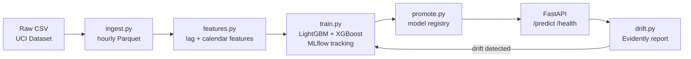

# Energy Forecast Platform

End-to-end ML platform that forecasts household energy consumption (next hour) using the UCI dataset. Demonstrates the full Applied ML engineering lifecycle: data pipeline → feature engineering → experiment tracking → model registry → REST API → drift monitoring.

## Architecture



## Tech Stack

| Layer | Tool |
|-------|------|
| Data processing | pandas |
| Feature engineering | pandas, holidays |
| Experiment tracking | MLflow |
| Models | LightGBM, XGBoost |
| Serving | FastAPI, uvicorn |
| Drift monitoring | Evidently, scipy |
| Containerization | Docker, docker-compose |
| Dependency management | uv |
| Testing | pytest |

## Quickstart

```bash
# 1. Install dependencies
uv sync

# 2. Download UCI dataset
# Search "UCI Individual Household Electric Power Consumption"
# Extract household_power_consumption.txt → data/raw/

# 3. Run pipeline
uv run python -m src.pipeline.ingest
uv run python -m src.pipeline.features

# 4. Start MLflow and train
uv run mlflow server --port 5000 &
uv run python -m src.training.train
uv run python -m src.training.promote

# 5. Start API
uv run uvicorn src.serving.app:app --port 8000
```

Or with Docker (after running training to populate MLflow):

```bash
docker compose up mlflow-server api
```

## Sample Request

```bash
curl -X POST http://localhost:8000/predict \
  -H "Content-Type: application/json" \
  -d '{
    "timestamp": "2024-06-01T08:00:00",
    "lag_1h": 0.52, "lag_24h": 0.48, "lag_168h": 0.51,
    "rolling_mean_24h": 0.50, "rolling_mean_7d": 0.49, "rolling_std_24h": 0.08,
    "periods": 24
  }'
```

Response:
```json
{
  "forecasts": [
    {"timestamp": "2024-06-01T08:00:00", "forecast_kwh": 0.51},
    {"timestamp": "2024-06-01T09:00:00", "forecast_kwh": 0.49},
    ...
  ]
}
```

## Run Tests

```bash
# Fast tests (no services needed)
uv run pytest tests/ -v --ignore=tests/test_smoke.py

# Smoke test (no services needed, ~5s)
uv run pytest tests/test_smoke.py -v -m slow
```

## Project Structure

```
src/
├── pipeline/    ingest.py, features.py
├── training/    train.py, promote.py
├── serving/     app.py
└── monitoring/  drift.py
```

## Drift Monitoring

After the API has received ≥30 prediction requests, run:

```bash
uv run python -m src.monitoring.drift
```

Generates an Evidently HTML drift report in `reports/` and prints a retraining recommendation if >30% of feature columns show significant distribution shift.
